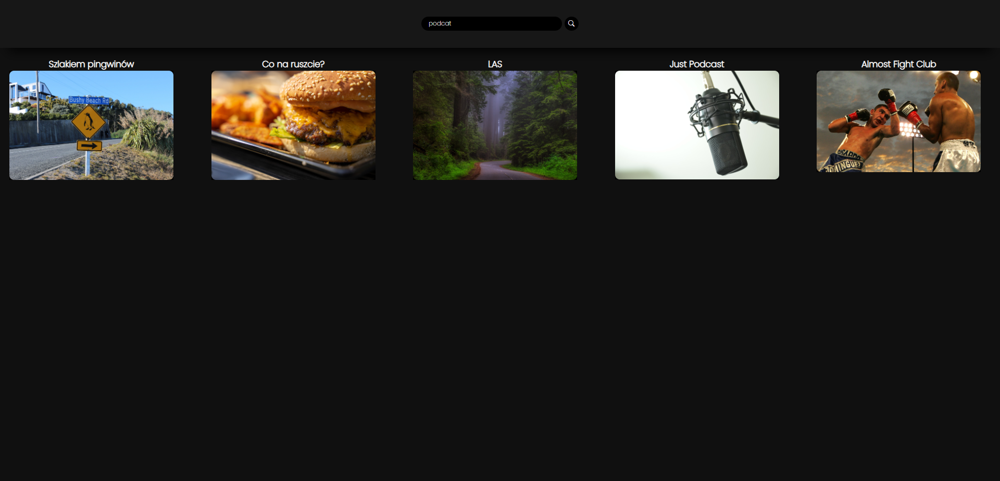
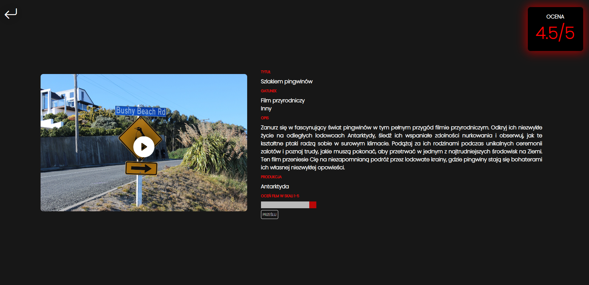
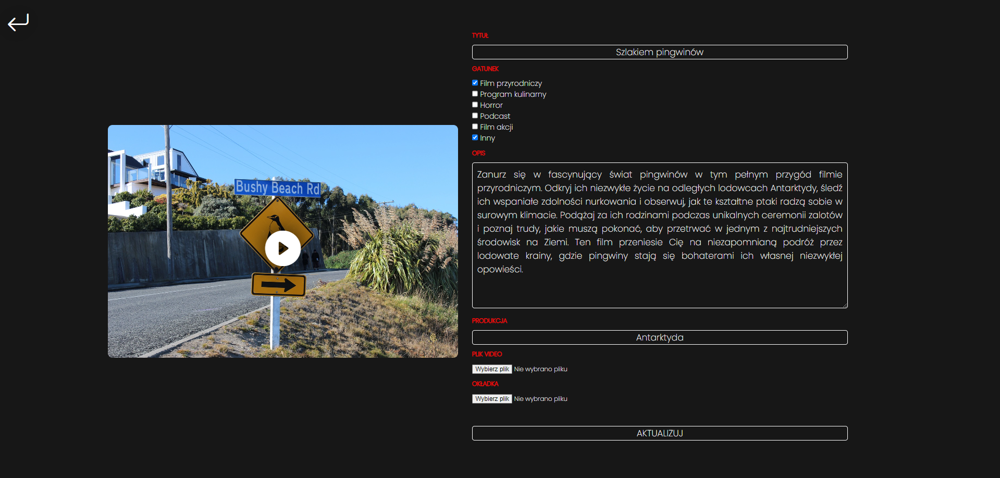
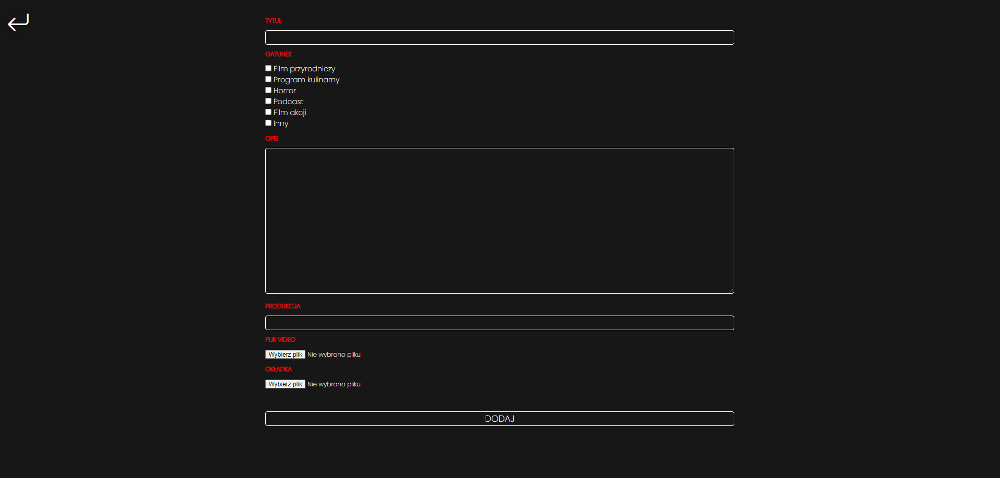
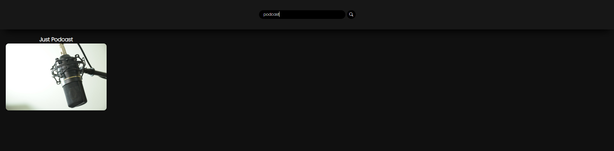

## NETFLIX-clone

Aplikacja NETFLIX-clone związana jest z funkcjonalnościami znanych z autentycznego serwisu streamingowego NETFLIX (odtwarzanie, ocenianie, wyszukiwanie po tytułach) oraz warstwą REST API. Aplikacja powstała przy użyciu framework'a Laravel.

## Funkcjonalności

- Strona główna

 

- Szczegóły filmu

 

- Edycja filmu

 

- Dodawanie filmu

 

- Odtwarzanie filmu

 

- Wyszukiwanie po tytułach

 

## ZASOBY
Wszystkie materiały foto & video zaczerpnięto ze stron:

- <a href="https://pixabay.com/">Pixabay</a>
- <a href="https://www.pexels.com/">Pexels</a>

